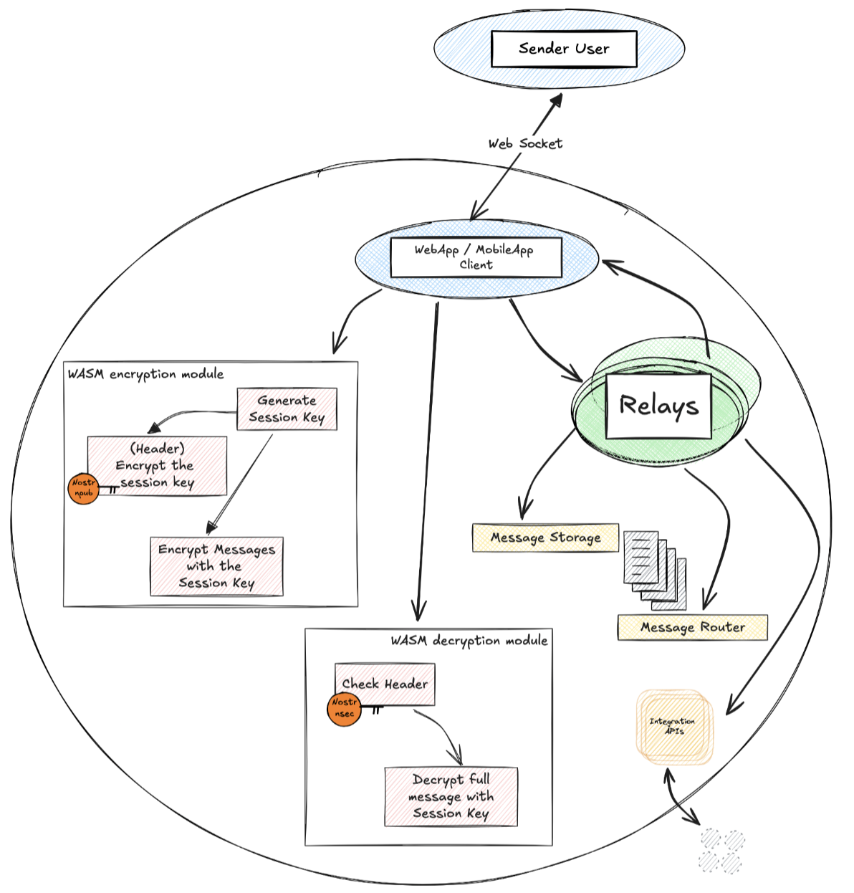

# Project Overview

The proposed distributed messaging system will offer users a secure, private and feature-rich communication experience. Below are the key features that users will be able to take advantage of:

1. **Private and secure communication**: Exchanged messages will be fully encrypted end-to-end, ensuring that only the legitimate receiver can decrypt and access the intended content. This approach ensures the confidentiality of conversations and protects users' privacy.

2. **Comprehensive data protection**: In addition to encrypting the content of messages, the system will also protect associated metadata, such as sender/receiver identifiers. This additional security measure prevents unauthorized third parties from inferring sensitive information from contextual data.

3. **Nostr-based Authentication**: The system will leverage the Nostr protocol for identity management and user authentication. Each user will have a unique PUB/PRIV (NPUB/NSEC) key pair generated by Nostr, allowing for secure and decentralized identification. This approach eliminates the need to rely on central authorities and gives users full control over their digital identities.

4. **Extensible and open source architecture**: The system is designed to allow for future integrations and additional functionalities, while always keeping privacy as a central priority. Being open source, the community will be able to examine the code, propose improvements through a system similar to NIPs (Nostr Improvement Proposals), contribute modifications and audit the security of the system, thus strengthening its robustness and reliability.

5. **Intuitive and user-friendly interface**: Despite the system's advanced capabilities, special emphasis will be placed on offering an intuitive and user-friendly user interface. Users will be able to communicate and manage their identities in a simple and frictionless manner.

## Main features of the distributed messaging system

1. **Secure and decentralized messaging architecture**: The system employs a network of distributed relays to relay encrypted messages between users. This decentralized architecture ensures privacy and resilience to failures, avoiding dependence on a central server that could compromise the security or availability of the service.

2. **Authentication and key management based on Nostr protocol**: The platform leverages the Nostr protocol for the generation and management of user cryptographic keys. Each user possesses a key pair: a public key (npub) and a private key (nsec). Public keys are used to uniquely identify users and to encrypt messages destined for them. Private keys, on the other hand, remain under the exclusive control of each user and are used to decrypt received messages.

3. **Hybrid encryption of messages and metadata**: To ensure the confidentiality of communications, the system implements a hybrid encryption scheme. Messages and associated metadata are encrypted using the AES-GCM algorithm with a unique session key. These session keys are in turn encrypted using elliptic curve cryptography (ECC) using the receiver's public key. This combined approach provides a high level of security and efficiency in data encryption.

4. **Horizontal scalability through distributed relays**: The system architecture is based on a network of distributed relays that retransmit encrypted messages between users. These relays do not have access to the content of the messages or to the receivers' information, since they only handle encrypted data. This design allows for efficient horizontal scalability, since the load is distributed among multiple nodes in the network, avoiding bottlenecks and guaranteeing high performance even in high-traffic scenarios.

5. **Extensibility and collaborative development**: The system implements well-documented APIs for future integrations (such as Nostr native zaps for payments), while keeping privacy as a priority. Being open source, the community can examine the code, propose improvements through a structured proposal system, contribute modifications, and audit security, strengthening the overall robustness of the system.

6. **Privacy through data volume**: The system implements an innovative strategy to ensure privacy from its initial launch. By randomly encrypting existing messages on the Nostr network, a significant volume of encrypted data is generated that allows users' real messages to be "camouflaged." This solution addresses the initial privacy challenge in new systems, where low message volume could compromise anonymity. As the network grows and message volume naturally increases, this additional layer of protection is complemented by the system's organic traffic.

|     | [← Introduction](1-introduction.md) | [Index](../README.md) | [Secure Message Flow →](3-secure-message-flow.md) |
| :-- | :---------------------------------: | --------------------: | ------------------------------------------------- |
