# Sequence Diagram

```mermaid
sequenceDiagram
    participant SC as Sender Client
    participant S as Server (Relay)
    participant RC as Receiver Client

    Note over SC: Generate session key (AES-GCM)
    Note over SC: Encrypts messages and metadata (session key)
    Note over SC: Encrypts session key (Nostr pub key of the recipient)

    SC->>S: Send header + encripted message (stored in relay)
    RC->>S: Request headers
    S->>RC: Send available headers

    Note over RC: Verifies Headers (Nostr priv key)

    rect rgb(40, 40, 40)
        Note over S,RC: Message is for the receiver
        S->>RC: Send header as reference
        S->>RC: Send associated encrypted message
        Note over RC: Decrypt message (session key)
    end

```

| [← Secure Message Flow](3-secure-message-flow.md) | [Index](../README.md) | [System Components →](5-system-components.md) |
| :------------------------------------------------ | :-------------------: | --------------------------------------------: |
